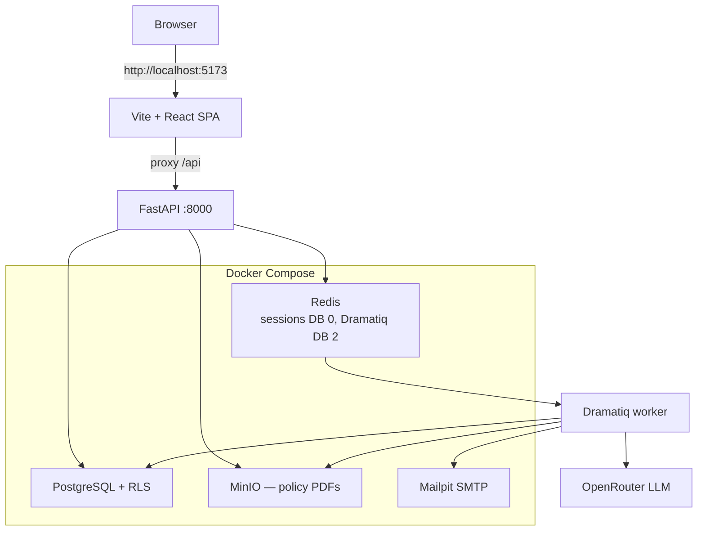
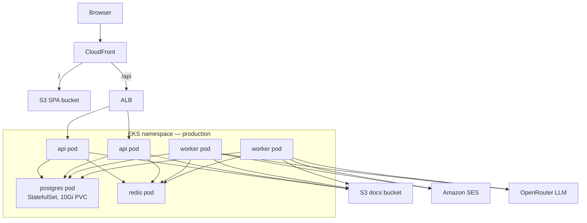

# Architecture

Insurance Tracker is a small multi-tenant app: a broker or owner uploads
policy PDFs, reviews extracted fields, and tracks renewals for their own
portfolio. One login owns one portfolio. Data never crosses users.

## Development

Vite proxies `/api` to the API so the session cookie stays first-party.
Postgres, Redis, MinIO, and Mailpit run in Compose; the API and worker
usually run on the host.

## Production

Staging and production are the same shape on one shared EKS cluster
(namespace per env). Cluster deploy is Terraform. CloudFront is the
HTTPS host so `/` and `/api` stay same-origin.

API and worker Deployments run two pods each. Postgres is a StatefulSet
(one replica); Redis is a Deployment (one replica). Pods reach S3 and
SES through IRSA on the `insurance-tracker` ServiceAccount. A migrate
Job runs Alembic once per deploy before the API pods start. Images come
from ECR.

## Components

**React SPA.** Vite + React Router. The browser talks only to relative
`/api/v1/...` with cookies. Pages cover login, uploads, review/confirm,
the portfolio dashboard, properties, policy detail, reminders, and
profile. Vite proxies `/api` in development. AWS serves the built SPA
from S3 via CloudFront.

**FastAPI API.** HTTP adapter only: cookies, status codes, Pydantic
schemas. Routers call services; services own use cases (auth, confirm
upload, reminders); repositories own SQLAlchemy. Workers skip HTTP but
still go through repositories. Auth is a Redis-backed session cookie,
not JWTs.

**PostgreSQL.** Source of truth for users, properties, documents,
policies, year-over-year series, and reminders. Row-level security
ties every owned row to `app.user_id`. Repository queries also filter
by `user_id` so a missed `WHERE` still cannot leak another user's data.

**Redis.** Two databases on one instance: DB 0 holds hashed session
tokens; DB 2 is the Dramatiq broker. Sessions last seven days.

**Object storage (MinIO / S3).** Uploaded PDFs live at
`{user_id}/{document_id}.pdf`. Local and Kubernetes use MinIO; AWS uses
a real S3 bucket with IRSA (no static keys). The worker refuses keys
that are not owned by the job's user.

**Dramatiq worker.** Pulls jobs from Redis. It extracts policy
declarations (LangGraph + LLM into a fixed JSON schema), sends
verification / password-reset / renewal emails, and hourly re-enqueues
a reminder scan. Extraction is async so the upload request can return
immediately; the user reviews fields before anything is committed to
the portfolio.

**OpenRouter.** The LLM behind extraction (`openai/gpt-4o-mini` by
default). The graph selects declaration-like pages, asks for structured
output, and stores `null` rather than guessing. Tests use a fake LLM;
CI never calls the live API.

**Email (Mailpit / SES).** Local SMTP goes to Mailpit
(http://localhost:8025). Staging and production send through Amazon SES
when `ses_from_address` is set. Renewal emails only go to verified
addresses.

**Front door.** Development uses Vite's `/api` proxy. Production uses
CloudFront (`/` → S3, `/api` → ALB → api pods).
