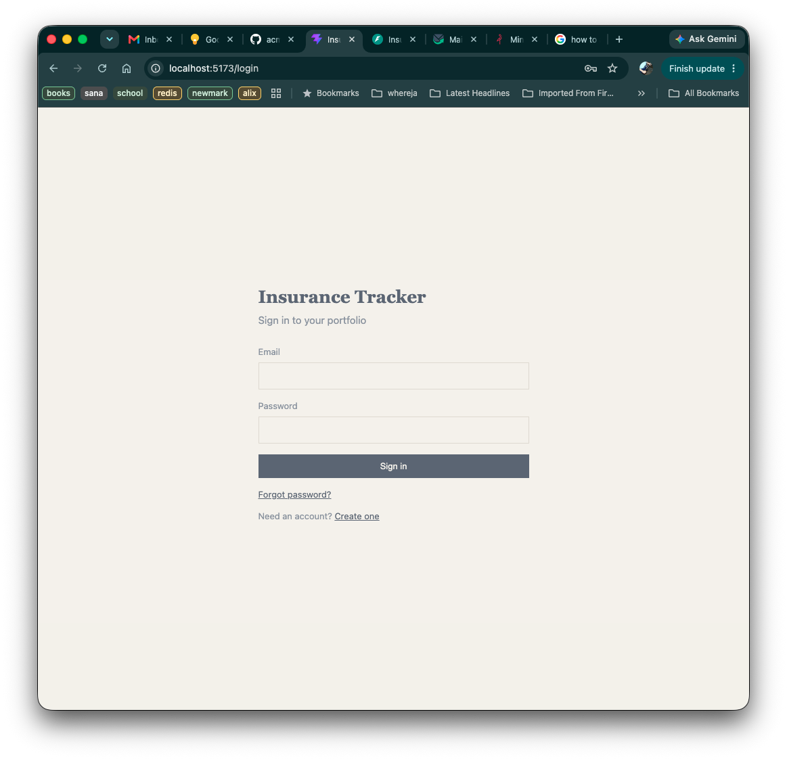
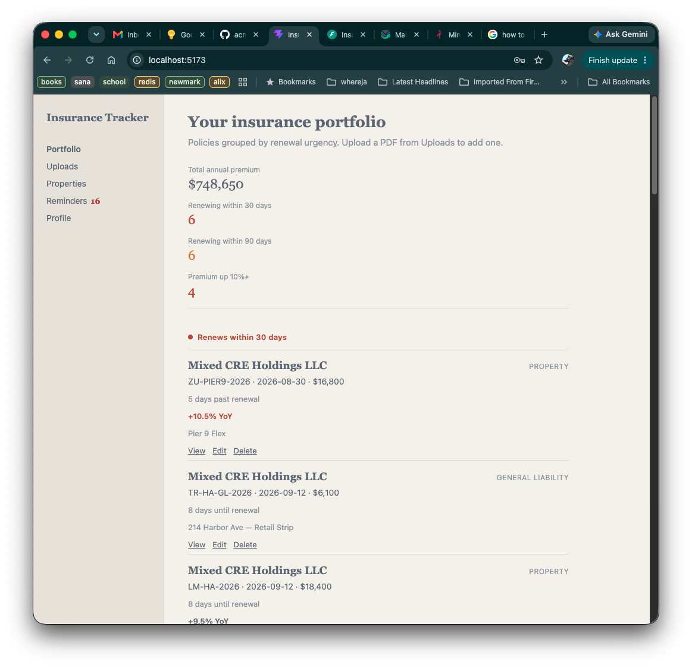
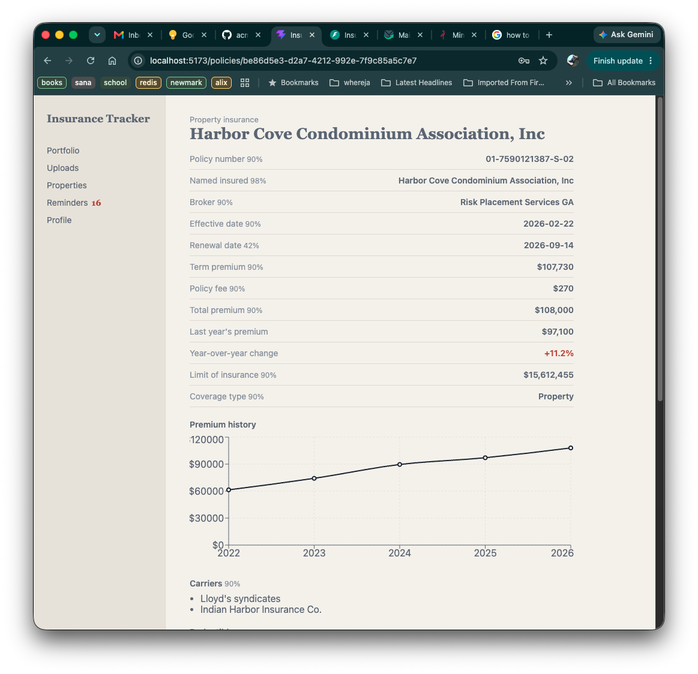
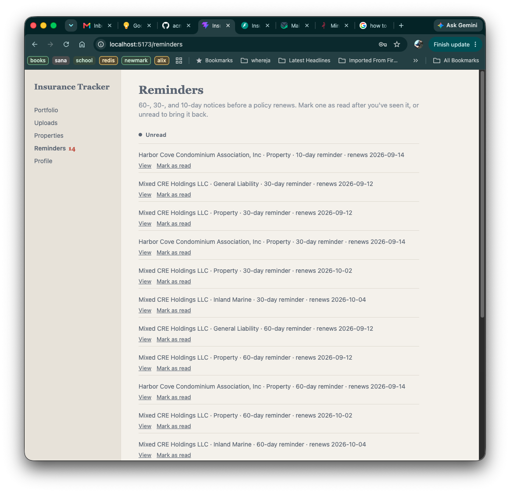
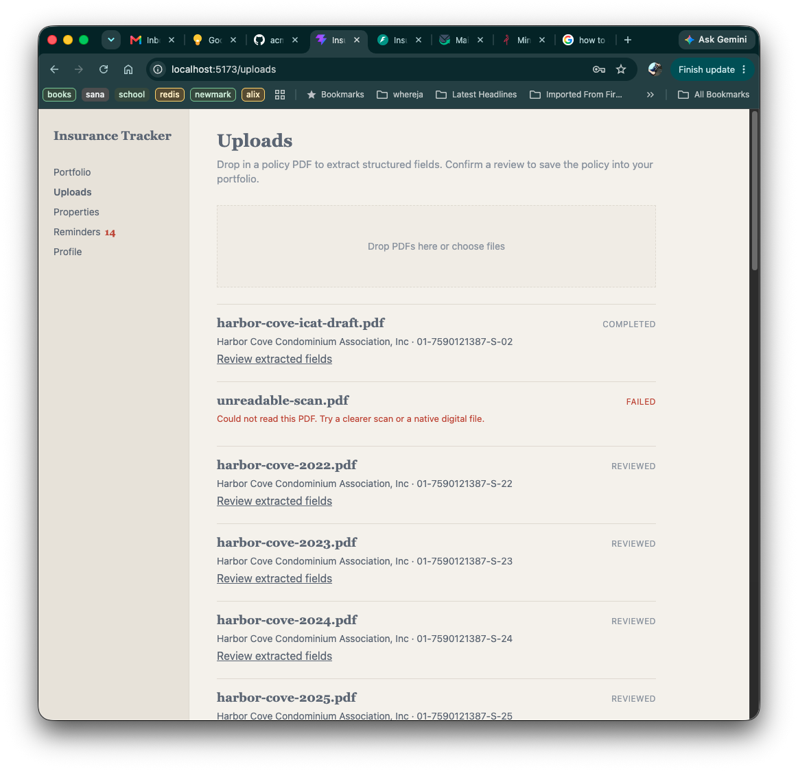

# Local demo

A ~15 minute walkthrough of what is built: sign in, a CRE portfolio
grouped by renewal urgency, year-over-year premium trends, reminders,
PDF extraction review, and per-user isolation.

Use this on a laptop in front of someone. All data is synthetic. Do not
run the seed against a non-local database.

## What you need

- Docker
- [uv](https://docs.astral.sh/uv/)
- Node.js 22+
- This repo, with `.env` present (`cp .env.example .env` if you have
  never run locally)

An OpenRouter API key is **not** required. Fake data already includes a
completed extraction and a failed job. Live PDF extraction is optional
at the end.

## 1. Start the servers

From the repo root, two terminals:

```bash
make serve
```

Wait until uvicorn is listening on port 8000. `make serve` also starts
Postgres, Redis, MinIO, Mailpit, runs migrations, and starts the
background worker.

```bash
make frontend
```

Wait until Vite prints the local URL.

Open **http://localhost:5173**. You should see the sign-in page.



Optional checks if something looks stuck:

| What | Where |
|---|---|
| API | http://localhost:8000/docs |
| Mailpit (local inbox) | http://localhost:8025 |
| MinIO console | http://localhost:9101 |

## 2. Load fake data

In a third terminal, still from the repo root:

```bash
make load-fake-data
```

This wipes only the five demo emails below and reloads them. Other local
users are left alone. Safe to re-run if you edited data during a
rehearsal.

Password for every demo account: `demo-pass-1`

## 3. Accounts — pick by what you want to show

Stay on **casey** for the main story. Switch only when you need a
different angle.

| Login | Named insured | Use this account to show |
|---|---|---|
| `casey@example.com` | Mixed CRE Holdings LLC | Full product: urgency buckets, YoY flags, Harbor Cove (multi-building, multi-deductible, trend chart), reminders, review/failed uploads, an unattached property |
| `alex@example.com` | Harbor Retail Partners LLC | Isolation — a different owner's retail portfolio; casey’s data is gone |
| `jordan@example.com` | Sundale Multifamily Holdings LLC | A multifamily-only book |
| `morgan@example.com` | Fenmore Industrial LLC | An industrial-only book |
| `riley@example.com` | Meridian Office Partners LLC | An office-only book |

## 4. Walkthrough (casey)

Sign in as `casey@example.com` / `demo-pass-1`.

### Portfolio (Home)

Point at the summary strip, then the grouped list:

- **Urgent** (renews within 30 days) — includes past-due (Pier 9 Flex,
  −5 days) and near-term (Harbor Ave, Harbor Cove, Fenmore property).
- **Soon** (31–90 days).
- **On track** (>90 days).
- **No renewal date** — prior-year Harbor Cove/Harbor Ave/Coldwater
  terms (kept so YoY has history without flooding Urgent) plus
  Westbrook (current policy, date unknown).



Call out:

- Coverage type on each card (Property, GL, Flood, Umbrella, Inland
  Marine).
- **YoY badges** — Harbor Cove and Harbor Ave are flagged (≥10%
  premium increase). Coldwater is in a series but under the 10%
  threshold.
- One login owns one portfolio. There is no team/shared account.

Open **Harbor Cove Condominium Association, Inc** (the current term,
~10 days to renewal).



### Policy detail — Harbor Cove

This is the “real policy shape” example:

- Multiple **deductibles by peril** (hurricane %, wind/hail,
  earthquake, all other).
- Multiple **locations** (Buildings 1–3).
- Multiple **carriers**.
- **Premium trend chart** for 2022–current. Premium is up enough to
  flag YoY.
- Low-confidence **renewal date** (42%) next to high-confidence named
  insured — extraction is reviewable, not blindly trusted.
- Link to the source document.

Optional: **Edit** to show the policy form (money fields, deductibles,
locations, attached properties). Do not save unless you will re-seed.

### Reminders

Open **Reminders** in the nav (badge is unread count).

The first visit creates 10 / 30 / 60-day items from renewal dates.
Mark one read so the badge drops. Say that verified users also get
email; Mailpit is the local inbox (seed users are already verified).



### Properties

Open **Properties**.

- Attached assets (Harbor Cove, Harbor Ave, Sundale, …).
- **Larkspur Parcel** is in the book but not on a policy — owners
  track land before coverage exists.
- **Add property** / edit / delete are live; skip delete in a demo.

### Uploads and review

Open **Uploads**.

- `harbor-cove-icat-draft.pdf` — **completed**, ready to review
  (extraction without confirming yet).
- `unreadable-scan.pdf` — **failed**, with a plain-language error.



Click **Review extracted fields** on the completed job:

- Low-confidence fields are highlighted (<70%).
- Confirming writes a saved policy onto the portfolio.

Do not confirm if you want the draft to stay on Uploads for the next
run. Re-seed if you do confirm.

### Profile

Open **Profile**. Email is shown; password can be changed in-session.
Skip changing it in a live demo (or re-seed afterward).

## 5. Isolation (alex)

**Log out**, then sign in as `alex@example.com` / `demo-pass-1`.

Alex is Harbor Retail Partners — strip centers, no Harbor Cove, no
Casey’s industrial/multifamily mix. Reminders and the nav badge are
Alex’s only. This is the per-user data boundary: one login, one
portfolio.

If you have time, log in as jordan / morgan / riley for asset-class
variants. Same password.

## 6. Optional — live PDF upload

Only if `.env` has `OPENROUTER_API_KEY` set **and** you restarted
`make serve` after adding it.

On **Uploads**, drop a policy PDF. Status moves pending → processing →
completed or failed (worker + LLM). Then use the same Review screen as
the seed draft.

An example PDF file is provided for the testing purposese. @[**docs/example_pdf**]

Without a key, skip this; the seed already shows the review path.

## 7. Optional — register and email

From the login page, **Register** a throwaway address. The yellow
banner asks you to verify email before renewal emails go out. Open
http://localhost:8025, open the message, follow the link.

Skip if you are short on time; seed accounts are already verified.

## 8. Stop and end

1. Log out in the browser (or close the tab).
2. In the frontend terminal: **Ctrl+C**.
3. In the `make serve` terminal: **Ctrl+C** (stops the API and the
   worker).
4. Stop Compose services:

```bash
docker compose down
```

That leaves named volumes (Postgres data, MinIO files) so the next
`make serve` comes back with the same demo users. To wipe the database
too:

```bash
docker compose down -v
```

Next demo: start servers again (step 1), then `make load-fake-data`
(step 2) so the walkthrough is back to a known state.

## If something is wrong

| Symptom | What to do |
|---|---|
| Vite cannot reach the API | `make serve` must still be running on port 8000 |
| Login rejected | Re-run `make load-fake-data`; password is `demo-pass-1` |
| Empty portfolio after login | You are not on a demo account, or seed has not run |
| Reminders empty on first visit | Hard-refresh `/reminders`; items are created on first GET |
| You confirmed the draft / changed a password | `make load-fake-data` again |

Fixture details: [plans/13-dev-demo-fixtures.md](plans/13-dev-demo-fixtures.md).
Local architecture: [architecture.md](architecture.md).
